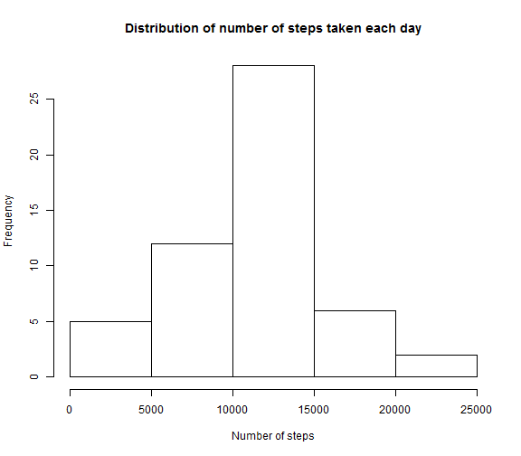

Peer Assessment 1
========================================================

## Loading and procesing the data


```r
activity <- read.csv("activity.csv", header = TRUE, stringsAsFactor = FALSE)
```


```r
summary(activity)
```

```
##      steps           date              interval   
##  Min.   :  0.0   Length:17568       Min.   :   0  
##  1st Qu.:  0.0   Class :character   1st Qu.: 589  
##  Median :  0.0   Mode  :character   Median :1178  
##  Mean   : 37.4                      Mean   :1178  
##  3rd Qu.: 12.0                      3rd Qu.:1766  
##  Max.   :806.0                      Max.   :2355  
##  NA's   :2304
```


## What is mean total number of steps taken per day?


```r
hist(tapply(activity$steps, activity$date, sum, na.rm = FALSE), main = "Distribution of number of steps taken each day", 
    xlab = "Number of steps")
```

 


## The mean and median total number of steps taken per day

```r
auxActivity <- na.omit(activity)
totalStepsMean <- mean(tapply(na.omit(auxActivity$steps), auxActivity$date, 
    sum, na.rm = FALSE))
totalStepsMedian <- median(tapply(na.omit(auxActivity$steps), auxActivity$date, 
    sum, na.rm = FALSE))
```

If we don't consider the NA values the mean is 1.0766 &times; 10<sup>4</sup> and the median is 10765

## Imputing missing values
* Calculate and report the total number of missing values in the dataset 

```r
missValue <- length((activity$steps[which(is.na(activity$steps) == TRUE)]))
```

The total number of missing values in the data set is 2304

* Devise a strategy for filling in all of the missing values in the dataset. The strategy does not need to be sophisticated. For example, you could use the mean/median for that day, or the mean for that 5-minute interval, etc.

```r
intAvg <- as.data.frame(tapply(activity$steps, activity$interval, mean, na.rm = TRUE))
names(intAvg) <- c("steps")
```


* Create a new dataset that is equal to the original dataset but with the missing data filled in.

```r
activity[is.na(activity)] = intAvg$steps
activity$steps <- round(activity$steps, 0)
summary(activity)
```

```
##      steps           date              interval   
##  Min.   :  0.0   Length:17568       Min.   :   0  
##  1st Qu.:  0.0   Class :character   1st Qu.: 589  
##  Median :  0.0   Mode  :character   Median :1178  
##  Mean   : 37.4                      Mean   :1178  
##  3rd Qu.: 27.0                      3rd Qu.:1766  
##  Max.   :806.0                      Max.   :2355
```


* Make a histogram of the total number of steps taken each day and Calculate and report the mean and median total number of steps taken per day. Do these values differ from the estimates from the first part of the assignment? What is the impact of imputing missing data on the estimates of the total daily number of steps?


```r
hist(tapply(activity$steps, activity$date, sum, na.rm = FALSE), main = "Distribution of number of steps taken each day", 
    xlab = "Number of steps")
```

 

```r
meanNA <- mean(tapply(na.omit(activity$steps), activity$date, sum, na.rm = FALSE))
medianNA <- median(tapply(na.omit(activity$steps), activity$date, sum, na.rm = FALSE))
```

After we changed the NA for the interval's mean the mean is 1.0766 &times; 10<sup>4</sup> and the median is 1.0762 &times; 10<sup>4</sup>
Including the missing values did not change so much the mean and the median. In the histogram we can see a distribution with more frequency in the interval where the median is.

## Are there differences in activity patterns between weekdays and weekends?

```r
Sys.setlocale("LC_TIME", "English")
```

```
## [1] "English_United States.1252"
```

```r
activity$date <- as.Date(activity$date)
activity$weekday <- weekdays(activity$date)
activity$weekday[activity$weekday == "Monday" | activity$weekday == "Tuesday" | 
    activity$weekday == "Wednesday" | activity$weekday == "Thursday" | activity$weekday == 
    "Friday"] <- "weekday"
activity$weekday[activity$weekday == "Saturday" | activity$weekday == "Sunday"] <- "weekend day"
activity$weekday <- factor(activity$weekday)
intAvgWeekday <- aggregate(steps ~ interval + weekday, data = activity, FUN = "mean")
library(lattice)
```

```
## Warning: package 'lattice' was built under R version 3.0.3
```

```r
xyplot(intAvgWeekday$steps ~ intAvgWeekday$interval | intAvgWeekday$weekday, 
    type = "l", layout = c(1, 2), xlab = "Interval", ylab = "Number of Steps")
```

 

We can see that during the weekend people walks more than during the weekdays. But during the weekdays we can see a peak in the interval 800 to 930 and people starts to walk earlier than during the weekend.
